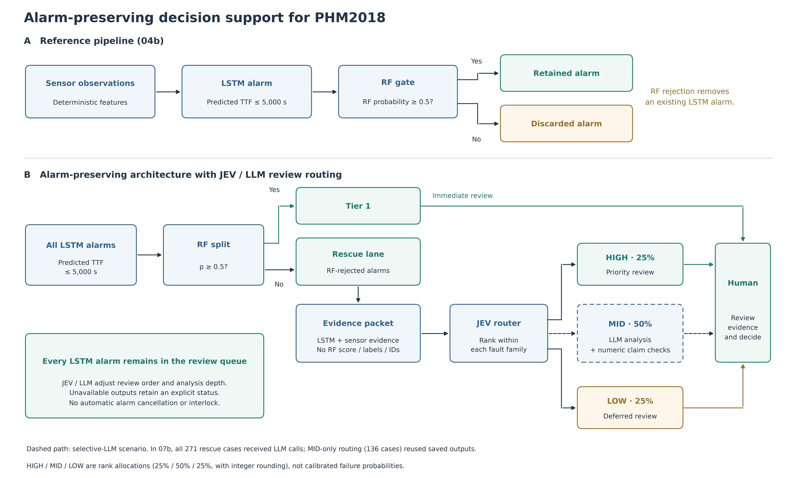
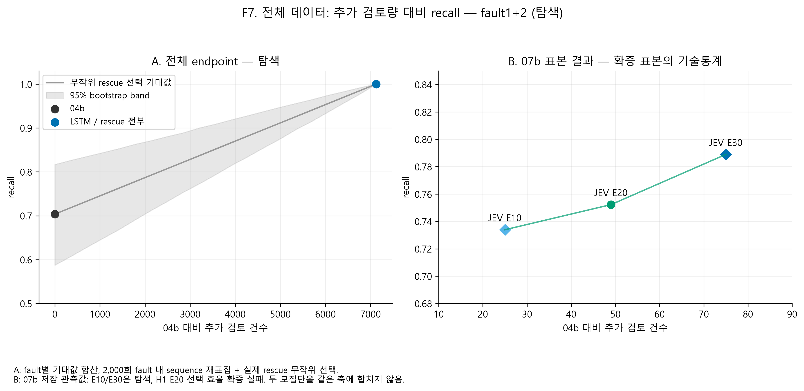
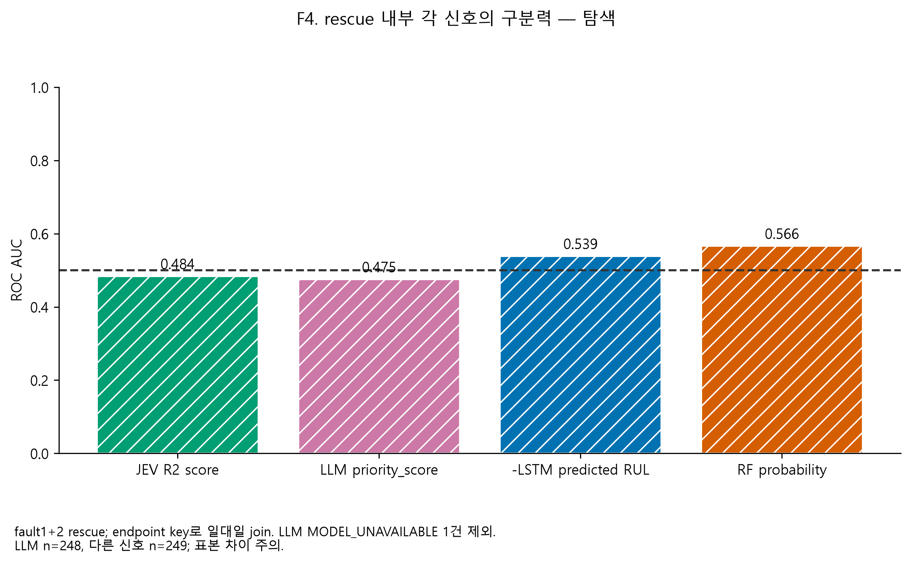

# FabJudge: JEV–LLM은 이상 탐지에서 Edge를 만들 수 있는가?

**PHM2018 이온 밀링 장비 데이터로 검증한 RF–LSTM 경보 보존 구조와 선택적 판단 계층**

학습된 RF–LSTM 고장 예측 파이프라인 위에 수치 판단 모델(JEV)과 LLM을 판단 계층으로 올리면 이상 탐지나 경보 우선순위가 좋아지는지 검증한 프로젝트입니다. 입력 표현, 스케일, 프롬프트, 파이프라인 위치를 바꿔 가며 시험한 뒤 사전 등록한 확증 실험으로 마무리했습니다.

> **결론 요약**
> 1. **판단 계층의 우위는 확인하지 못했습니다.** 사전 등록한 H1이 기각되지 못했고, 같은 입력을 받은 로지스틱 회귀가 LLM보다 나았습니다.
> 2. **대신 baseline의 RF 게이트가 실제 고장 경보를 버린다는 사실을 찾았습니다.** fault3 endpoint recall은 0.629 → 0.974(게이트 제거), fault1+2에서는 고장 사건 52건 중 6건을 게이트 때문에 놓쳤습니다.
> 3. **LLM은 저비용 참고 계층으로는 쓸 수 있습니다.** 경보당 약 $0.00026, 유효 응답 99.6%, 인용 수치 1,706개가 모두 입력과 일치했습니다. 사람의 판단에 주는 효용은 측정하지 않았습니다.

📄 **최종 보고서:** [docs/Fabjudge_leeyongmin.pdf](docs/Fabjudge_leeyongmin.pdf)

---

## 1. 무엇을 만들었나



- **(A) 04b baseline.** Huang et al. (2018)의 2단 구조(열화 탐지 → LSTM RUL)를 참고한 RF–LSTM 파이프라인입니다. `LSTM 예측 ≤ 5,000초` **그리고** `RF 확률 ≥ 0.5`일 때만 경보가 울리므로, RF가 "아니다"라고 하면 LSTM 경보가 사라집니다.
- **(B) 경보 보존 구조.** 04b 경보는 tier1으로 바로 검토하고, RF가 탈락시킨 LSTM 경보는 rescue lane에 남깁니다. rescue 경보는 JEV가 HIGH/MID/LOW로 나누고, LLM은 근거·반대 근거·추가 확인 항목을 붙입니다. 판단 계층에는 경보를 취소할 권한이 없습니다.

04b는 원 논문의 exact reproduction이 아닙니다. 저장된 기록만으로 원 논문의 전처리·분할·하이퍼파라미터를 동일하게 복원했다고 입증할 수 없어서 **Huang-inspired baseline**으로 부릅니다. 이 저장소의 "04b 대비" 수치는 모두 프로젝트 내부의 고정 baseline 기준이며, 원 논문이나 공식 challenge 성능과 비교한 것이 아닙니다.

## 2. 핵심 결과

### RF 게이트가 버린 경보 안에 실제 고장이 있다

| fault3 (전체 test endpoint) | TP | FN | 검토 endpoint | Recall | Precision |
|:--|--:|--:|--:|--:|--:|
| 04b (RF 게이트) | 293 | 173 | 439 | 0.629 | 0.667 |
| LSTM 경보 전부 유지 | 454 | 12 | 747 | **0.974** | 0.608 |

| fault1+2 (사건 단위) | 평가 가능 시퀀스 | 탐지 | 놓친 사건 |
|:--|--:|--:|--:|
| 04b | 52 | 46 | 6 |
| LSTM 경보 전부 유지 | 52 | **52** | 0 |

- fault3에서 RF가 버린 308개 endpoint 중 161개(52.3%)가 실제 임박 고장이었습니다. RF 게이트는 recall 34.5%p를 내주고 precision 6%p를 얻는 교환입니다.
- fault1+2에서는 LSTM이 모든 endpoint에 경보를 내고, 04b precision(0.187)도 기저율(0.165)과 큰 차이가 없습니다. 이 두 fault에서는 경보 판별력 자체가 약합니다.
- 결론: 이 설정에서는 RF를 **경보를 버리는 조건이 아니라 검토 우선순위 신호**로 쓰는 편이 낫습니다.

### 판단 계층은 우선순위를 개선하지 못했다 (사전 등록 확증)

| 가설 (fault1+2 rescue, E20) | 추정치 | 비교값 | 단측 95% 하한 | 판정 |
|:--|--:|--:|--:|:--|
| H1: JEV 정렬 > rescue 기저율 | 0.102 | 0.129 | −0.072 | 기각 실패 |
| H2: JEV 라우팅 vs 전체 LLM (비열등) | 0.102 | 0.102 | — | 미검정 (순차 규칙) |
| H3: JEV 라우팅 vs 무작위 | 0.102 | 0.130 | — | 미검정 (순차 규칙) |

rescue 안에서 각 신호의 AUC는 JEV 0.48, LLM 0.48, LSTM 0.54, RF 0.57이었고, 같은 16개 수치로 학습한 로지스틱의 precision@E20(0.184)이 LLM(0.102)보다 높았습니다(탐색 분석).

<p align="center">
  
  
</p>

## 3. 실험 여정

좋은 결과만 남기지 않고 실패와 정정까지 기록했습니다.

| 단계 | 질문 | 결과 |
|:--|:--|:--|
| 04b | Huang-inspired RF–LSTM baseline 구축 | fault별 RF 게이트 + LSTM RUL |
| 05a | JEV는 어떤 입력 표현에서 이상을 알아보나 | raw는 실패, train 기준 Robust 변환에서만 구간 순서가 맞음 |
| 05a 확장 | 숫자 스케일을 바꾸면 나아지나 | 0.1×~10× 모두 1×보다 나쁘거나 같음 |
| 05b | 프롬프트 문구 수정(v5), 표본 270개로 확대 | v5 사전 규칙 탈락. 표본을 키우자 v4의 구분 폭도 0.234 → 0.037로 축소 |
| 05c | JEV가 틀리는 이유에 대한 가설 프롬프트 10종 | 고정 검증기 기준 10종 모두 탈락 |
| 06a–b | LSTM 경보 뒤에서 JEV가 FP를 걸러내나 | 제거 경보 0건 |
| 06c | dev에서 정한 임계값이 test에서 유지되나 | in-sample dev 때문에 test recall 0.94 → 0.50으로 붕괴 |
| 06d | OOF RF와 결합하면 독립 신호가 있나 | dev AUC 0.83 → **누수 버그로 무효** |
| 06e | 버그 정정과 약점 진단 | 정정 후 AUC 0.59, 강한 독립 신호 없음 |
| 07a | LLM 파이프라인 뼈대, 키 분리, 스키마 검증 | 인프라 점검 통과, 표본 설계 결함 발견 |
| 07b | 사전 등록 확증 실험 | H1 기각 실패 |
| 08 | 전체 test endpoint로 04b와 최종 비교 | RF 게이트의 경보 누락 확인 |

## 4. 방법론에서 신경 쓴 것

- **사전 등록과 해시 고정.** 07b는 가설·표본·지표·정렬 규칙을 먼저 등록하고, 라벨을 열기 전에 순위를 확정했습니다. H1 → H2 → H3 순차 검정으로 다중 비교를 통제했습니다.
- **누수 차단.** 판단 계층 입력(EvidencePacket)에서 TTF, 라벨, 파일·시퀀스 ID, 시각, 표본 위치를 제거하고 코드로 검사했습니다.
- **버그와 정정의 공개.** 06d의 RF 누수를 스스로 찾아 결과를 무효 처리하고 06e에서 정정했습니다.
- **평가 함정 기록.** 고장 시각에 맞춰 잘린 시퀀스에서는 "시퀀스 안의 위치"가 곧 TTF 정보가 되는 위치 누수가 생깁니다. 이 신호는 feature로 쓰지 않고 진단에만 썼습니다([F5](artifacts/08_final_comparison/figures/F5_position_leakage.png)).
- **LLM 출력 검증.** LLM이 인용한 필드와 값을 원 입력과 자동 대조했습니다.
- **API 키 분리.** JEV와 LLM은 서로 다른 키와 로더를 쓰고, 교차 fallback이 없습니다.

## 5. 저장소 구조

```text
FabJudge-PHM2018/
├─ docs/
│  ├─ Fabjudge_leeyongmin.pdf          # 최종 보고서
│  ├─ jev_final_model_design.md        # 판단 계층 설계 문서
│  └─ figures/                         # 파이프라인 그림 S1 (scripts/draw_paper_pipeline.py로 생성)
├─ notebooks/                          # 00~08 실험 노트북 (실행 결과 포함)
├─ src/fabjudge/
│  ├─ huang2018*.py                    # 04b baseline
│  ├─ jev_*.py                         # 05~06 JEV 실험
│  ├─ pipeline/                        # 07 파이프라인: keys, clients, schemas, claims, routing ...
│  └─ final_comparison.py              # 08 최종 비교
├─ scripts/                            # 노트북 생성·실행 스크립트
├─ tests/                              # 키 분리, 캐시, 파이프라인 단위 테스트
└─ artifacts/                          # 공개 범위의 결과 표·그림만 포함
   ├─ 07b_rescue_lane_confirmatory/    # 사전 등록, 가설 검정, 요약
   ├─ 08_final_comparison/             # 표 T1~T6, 그림 F1~F7
   └─ huang2018/                       # 04b 지표
```

## 6. 재현 방법과 제한

**데이터는 포함하지 않습니다.** PHM Society 2018 Data Challenge 데이터를 받아 `data/raw/`에 그대로 두세요. 원시 측정값이 담긴 캐시와 04b test 예측 파일도 공개 범위에서 제외했습니다.

```bash
python -m venv .venv
pip install -r requirements.txt
pip install -r requirements-huang2018.txt   # CPU PyTorch
```

- 노트북은 번호 순서(00 → 08)대로 실행합니다. 04b가 이후 단계에 필요한 예측 파일을 다시 만듭니다.
- 05~07은 OpenRouter API를 호출합니다. `.env`에 `JEV_API_KEY`(JEV 전용)와 `GPT_LUNA_API_KEY`(LLM 전용)를 넣으세요. 키가 없으면 해당 단계는 실행되지 않습니다.
- 실행 기록상 모델은 JEV `typesafe/jev-1.13`(반환 `typesafe/jev-1.13-20260917`), LLM `~openai/gpt-luna-latest`입니다. 같은 이름이 나중에 다른 모델을 가리킬 수 있어 결과가 완전히 같게 재현되지 않을 수 있습니다.
- 07a는 노트북 대신 `scripts/run_07a.py`로 실행했습니다.
- 05~06 단계의 세부 산출물(응답 로그, 캐시 등)은 공개 범위에 포함하지 않았습니다. 해당 결과는 노트북의 저장된 출력과 최종 보고서에서 확인할 수 있습니다.

## 7. 한계

07b는 test 시퀀스의 고정 percentile 지점을 뽑은 표본입니다. fault3 test는 06 시리즈에서 이미 사용해 주 판정을 fault1+2로 두었습니다. train 구간 LSTM 예측은 in-sample이고, 시퀀스·장비 수가 제한적이며, 5,000초 단일 기준을 썼습니다. 사람을 대상으로 한 평가는 없습니다. JEV는 동료 심사를 거친 방법론이 아니라 외부 API로 다뤘습니다.

## 8. 참고문헌

- Huang, W., Khorasgani, H., Gupta, C., Farahat, A., & Zheng, S. (2018). Remaining Useful Life Estimation for Systems with Abrupt Failures. *Annual Conference of the PHM Society*, 10(1). https://doi.org/10.36001/phmconf.2018.v10i1.590
- Singh, K. et al. (2018). Concurrent Estimation of Remaining Useful Life for Multiple Faults in an Ion Etch Mill. *Annual Conference of the PHM Society*, 10(1). https://doi.org/10.36001/phmconf.2018.v10i1.591
- Vishnu T. V. et al. (2018). Recurrent Neural Networks for Online Remaining Useful Life Estimation in Ion Mill Etching System. *Annual Conference of the PHM Society*, 10(1). https://doi.org/10.36001/phmconf.2018.v10i1.589
- PHM Society (2018). PHM Data Challenge 2018 — Ion Mill Etch Tool. https://phmsociety.org/conference/annual-conference-of-the-phm-society/annual-conference-of-the-prognostics-and-health-management-society-2018-b/phm-data-challenge-6/
- OpenRouter. What Is Jev? https://openrouter.ai/blog/insights/what-is-jev/

---

### English summary

FabJudge tests whether a numeric decision model (JEV) and an LLM, added as a judgment layer on top of a Huang-inspired RF–LSTM failure-prediction pipeline for the PHM 2018 ion-mill dataset, improve alarm detection or prioritization. Across input-representation, scaling, prompt, and pipeline-placement experiments and a preregistered confirmatory test, no advantage was found (H1 failed to reject; a logistic regression on the same inputs outperformed the LLM). The process did surface a practical finding: the baseline's RF gate discards real imminent-failure alarms (fault3 endpoint recall 0.629 vs 0.974 without the gate; 6 of 52 failure events missed in fault1+2). The LLM layer is cheap (~$0.00026 per alarm) with 99.6% valid responses and fully verifiable numeric citations, so it can serve as a non-authoritative reference layer, though its value to human reviewers was not measured.
