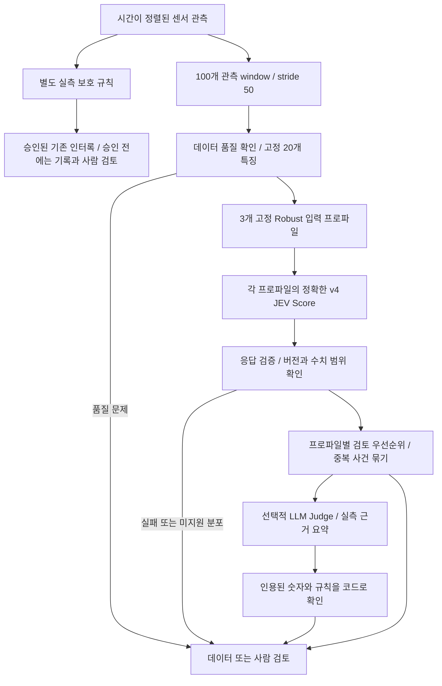

# FabJudge 최종 JEV 기반 모델 설계

작성일: 2026-09-27 · 설계 버전: 1.0 · 범위: 설계 문서만 작성

## 1. 설계 결정

**고정된 20개 특징 → 기존 train-only Robust 1× 변환 → 정확한 v4 질문 → JEV 점수 → 근거 기반 검토 우선순위 → 선택적 LLM 검토 → 사람의 최종 판단**을 채택한다. 실측 센서의 승인된 설비 보호 규칙은 이 흐름과 별도로 작동한다.

JEV의 역할은 설비 상태에 대한 보조 점수 생성이다. 기본 사용 방식은 과거 자료 재생과 shadow 관찰이며, 현재 근거로 JEV 점수에 자동 정상 승인·자동 인터록 권한을 부여하지 않는다. 이 문서에서 확정하는 것은 시스템 구조와 책임이다. 운영 임계값과 운영 성능은 아직 승인되지 않았다.

05c의 결론은 **“v4 최종 개량 미확인”**이다. 기존 v4는 비교 기준으로 유지한다. v4의 운영 적합성이 입증됐다는 뜻은 아니다. Noul 관문, v5, 05c 후보 10종은 최종 기본 경로에 포함하지 않는다. 후보들의 문구를 합치는 방식도 새로운 미검증 모델이므로 채택하지 않는다.

## 2. 설계의 근거

### 2.1 05c의 전체 결과

근거: [회차 요약](../artifacts/jev_v4_edge_trials/trial_summary.csv), [고정 명세 v1.2](../artifacts/jev_v4_edge_trials/validation_spec.json), [회차별 검증 결과](../artifacts/jev_v4_edge_trials/validations/), [최종 확인](../artifacts/jev_v4_edge_trials/final_confirmation.json).

- 동일 개발 window 45개, 그룹 40개를 10회 재사용했다. 450회 요청은 독립 표본 450개를 뜻하지 않는다.
- 각 회차는 같은 window의 같은 요청에 v4와 후보 질문을 함께 넣은 짝지은 비교다.
- ROC-AUC는 정상 대 고장근접 TTF 대리 구간만 비교한다. OOF macro-F1은 세 구간을 사용하며 타깃별 임계값을 각 fold의 학습 그룹에서만 선택한다.
- 10개 후보 모두 `REJECT`, 개발 보존 후보 0개다. 미사용 leak/고장근접 그룹은 기존 검증 풀에서 0개여서 최종 독립 확인은 `INCONCLUSIVE`, `verified=false`다.
- 아래 차이는 후보−같은 회차 v4다. F1은 타깃 평균 OOF macro-F1이며, 위험 오류는 기존 TTF 대리 구간 기준이다.

| 회차 | 바꾼 요소 | 후보 AUC / Δ | 후보 F1 / Δ | 주요 기각 이유 |
| --- | --- | --- | --- | --- |
| 01 | 양방향 편차 | 0.5667 / −0.0467 | 0.3163 / −0.0107 | 두 지표 악화, 정상→높음 및 고장근접→낮음 각각 1건 증가 |
| 02 | 동일 센서 증거 중복 제거 | 0.6067 / −0.0200 | 0.3696 / +0.0023 | AUC 안전 조건 미달 |
| 03 | 단독 peak 영향 억제 | 0.6067 / 0.0000 | 0.3595 / −0.0105 | 두 위험 오류는 감소했지만 F1 안전 조건 미달, 개선 분기 미통과 |
| 04 | 수준과 산포 구분 | 0.6200 / +0.0200 | 0.3554 / −0.0498 | ROC 분기는 통과, F1 안전 조건 미달 |
| 05 | shape factor 의미 설명 | 0.6667 / +0.0267 | 0.3368 / −0.1478 | ROC 분기는 통과, F1 하락 및 정상→높음 2건 증가 |
| 06 | skewness 의미 설명 | 0.5667 / −0.0333 | 0.3555 / −0.0782 | 두 지표 악화, 고장근접→낮음 1건 증가 |
| 07 | 냉각 압력·유량 관계 | 0.6133 / +0.0333 | 0.4048 / −0.1458 | AUC 절대 기준 미달, F1 하락 및 고장근접→낮음 2건 증가 |
| 08 | 0·1·2 단계 앵커 | 0.5733 / −0.0467 | 0.3952 / +0.0703 | F1 절대 기준 미달, AUC 안전 조건 미달 |
| 09 | 센서별 이상 방향 해석 | 0.5933 / −0.0200 | 0.4345 / −0.0124 | 두 지표 안전 조건 미달 |
| 10 | 연속 점수 분해능 | 0.6200 / −0.0133 | 0.4458 / +0.1137 | F1 0.45 기준 및 AUC 허용 하락 0.01 조건 미달 |

최고 AUC인 05번이나 최고 F1인 10번을 사후 선택하지 않는다. 03번의 F1 하락은 기준을 근소하게 넘지만, 그 결과를 본 뒤 허용치를 완화하지 않는다. v1.2의 부동소수점 등호 처리 수정으로 04번 ROC 분기가 바로잡혔으며, 최종 기각은 유지됐다. [수정 이력](../artifacts/jev_v4_edge_trials/validator_migration_v1_2.json)에 근거한다.

v4 자체의 회차별 macro AUC는 **0.58–0.64**, OOF macro-F1은 **0.3249–0.5506**이다. 저장된 응답 10종에서 같은 표본의 v4 점수도 달라졌다. 후보 질문이 함께 바뀌므로 순수 반복 변동과 질문 구성의 영향을 분리할 수 없다. 후보 간 최고 수치를 직접 순위화하거나 작은 점수 차이를 안정된 개선이라고 해석하지 않는다.

특히 05c의 v4 leak AUC는 회차별 **0.32–0.40**이다. 낮은 점수만으로 누출 위험을 배제할 근거가 없다. 이 결과를 보고 leak 점수 부호를 뒤집는 것도 새 사후 가설이므로 채택하지 않는다. 기존 보존 조건의 위험 오류 검사는 전체 합계에 기반하므로, 향후에는 타깃별 악화도 별도로 제한해야 한다.

### 2.2 앞선 실험과의 연결

| 근거 | 확인된 결과 | 최종 설계 반영 |
| --- | --- | --- |
| 05a 및 스케일 실험 | 작은 45-window 표본에서 Robust가 유망했으나, pressure shape 특성의 0.5×·2× 및 0.1×·10× 변경은 각 배치의 1× 대조군 대비 종합 개선을 보여주지 못함 | 기존 Robust 1× 유지, 새로운 배율 최적화 제외 |
| 05b | 개발 v4 AUC 0.6017, v5 0.5838. v5가 고정 선택 규칙 탈락 | 정확한 v4 질문 유지 |
| 05b diagnostics | 세 단계 분류의 그룹 CV balanced accuracy 0.3722, 이미 관찰된 holdout 0.3889. 임계값 bootstrap 구간이 넓음 | 과거 탐색 임계값을 운영 기준으로 승격하지 않음 |
| Noul 후속 탐색 | 과거 관찰 평가에서 macro-F1 0.410→0.160, 고장근접→낮음 5/30→12/30, 검토 필요 47/90 | Noul로 저위험 자동 통과시키는 관문 제외 |
| Noul 출력 분포 | 평가에서 Noul>0.6이 0개. 자동 판정 43개가 모두 낮은 위험 | 임의의 0.4/0.6 구간을 최종 게이트에 재사용하지 않음 |

Noul 실험의 평가는 05b에서 이미 본 그룹을 재사용했다. 위 수치는 독립 검증 수치가 아니다. 05a의 큰 분리도와 05b의 작은 분리도는 서로 다른 표본의 결과라서 원인을 프롬프트나 모델 변화 하나로 단정할 수 없다.

근거: [05a 결과](../artifacts/jev_tut/representation_summary.csv), [스케일 비교](../artifacts/jev_scale_sensitivity/extreme_0p1_10x/summary.md), [05b 요약](../artifacts/jev_prompt_optimization/run_summary.md), [diagnostics](../artifacts/jev_prompt_optimization/diagnostics/summary.md), [Noul 실행 결과](../artifacts/jev_prompt_optimization/noul_followup/reused_groups_exploratory/run_summary.md).

## 3. 입력과 분석 단위

### 3.1 재현할 입력 계약

분석 단위는 파일 안에서 `runnum`이 연속해서 같은 구간 내의 **100개 관측값 window, 이동 50개 관측값**이다. 같은 run 번호가 나중에 재등장하면 별도 `sequence_index`를 부여한다. 같은 시각의 복수 관측은 원본 순서를 보존한다. 평가 라벨은 window 마지막 행의 TTF다. window 뒤의 센서 값은 추론에 사용하지 않는다.

약 4초 간격이라면 window는 약 400초 규모지만, 정확한 범위는 `start_time/end_time`으로 표시한다. 이를 100초 window나 저지연 실시간 인터록 입력으로 설명하지 않는다. 시간 역행·큰 공백·미확인 공정 전환은 품질 검토 대상으로 표시한다. 기존 전처리가 `recipe_step` 변화까지 분할한다는 가정을 하지 않는다.

13개 센서 × 8개 통계량에서 기존 선택 목록의 20개를 고정한다. 숫자 특징은 [정규화 전 window 특징](../data/interim/phm2018_jev/features/)에서 읽고, 02의 Tool별 표준화 결과에 Robust를 다시 적용하지 않는다. 특징 이름·순서는 [기존 20개 목록](../artifacts/random_forest/jev_candidate_features.csv) 및 [05a 설정](../artifacts/jev_tut/config.json)을 따른다.

원래 통계식과 결측 처리를 보존한다. 센서별 유효 관측이 80% 미만이거나 통계량 분모가 0이면 해당 특징은 결측이다. 선택된 20개 중 하나라도 결측 또는 비유한수이면 JEV 점수를 만들지 않고 `DATA_REVIEW`로 보낸다. 새 중간값 대치·클리핑·배율 변경을 묵시적으로 추가하지 않는다.

설명에 사용하는 통계 의미도 고정한다. `peak_abs=max(abs(x))`, `rms=sqrt(mean(x²))`, `shape_factor=rms/mean(abs(x))`다. **RMS에는 평균 수준과 변동이 함께 들어 있으므로 산포와 동일시하지 않는다.** Robust 값은 기준 분포에 대한 무차원 상대값이다. 센서 물리 단위나 설비 허용 한계로 변환해서 설명하지 않는다.

근거: [02 전처리](../notebooks/02_jev_preprocessing.ipynb), [05c 입력 복원 코드](../src/fabjudge/jev_v4_edge_trials.py).

### 3.2 타깃별 scaler를 온라인에서 다루는 방법

기존 [scaler](../artifacts/jev_tut/train_scaler_stats.json)는 하나가 아니라 pressure-low, pressure-high, leak별로 다르다. 해당 타깃의 TTF가 유한한 **03 학습 그룹**에서 각각 추정됐고, 기존 실험은 평가 행의 target에 맞춰 변환을 선택했다. 따라서 “20개 특징에 Robust 한 번”만으로는 기존 입력을 정확히 기술할 수 없다.

최종 설계에서는 세 scaler를 **고정된 입력 프로파일**로 등록한다. 라벨이 없는 한 window에 세 프로파일을 모두 적용한다.

`z[p,f] = (x[f] - median_approx[p,f]) / safe_iqr[p,f]`

기존 분위수는 학습 그룹 중 `window_index % 20 == 0` 표본에서 근사한 값이며, 원래 IQR이 `1e-12` 이하이면 저장된 `safe_iqr=1`을 사용한다. 이 통계 파일을 그대로 버전 고정하고 신규 관측으로 자동 재적합하지 않는다.

- `p`는 사전에 정한 세 프로파일이며, 미래 TTF나 실제 고장 종류를 읽어서 선택하지 않는다.
- 각 프로파일은 같은 v4 질문을 사용하고 결과를 별도로 저장한다. 이름은 scaler의 출처를 나타낸다. 누출 확률·고장 유형 분류 결과로 표시하지 않는다.
- 서로 다른 프로파일 점수를 평균·최댓값으로 합쳐 하나의 위험 확률이나 종합 안전 판정을 만들지 않는다. 검토 대상의 합집합만 만든다.
- 전체 세 프로파일을 한 window에 적용하는 구조는 **이번 최종 설계의 제안**이다. 05c는 타깃별 선택 표본을 평가했으며 이 전체 구조의 성능을 검증하지 않았다.
- 정상 실행 시 window당 최대 3회 JEV 요청이 필요하다. 기존 450회 실험 비용을 이 구조의 처리 비용으로 제시하지 않는다.

이 선택은 기존 변환을 재현하면서 추론 시 정답 target을 요구하지 않기 위한 것이다. 하나의 공통 scaler로 통합하려면 label-agnostic 학습 집합을 정의하고 별도 버전으로 평가해야 한다. 이번 설계에는 그 통합을 포함하지 않는다.

### 3.3 데이터 분할의 해석

기존 `source_file::sequence_index` 분리는 겹치는 window가 서로 다른 fold에 들어가는 것을 막는 최소 단위다. 동일 장비의 다른 run이나 같은 고장 사건을 향하는 여러 run까지 독립임을 보장하지 않는다. 후속 검증에서는 Tool·시간·정비/고장 사건 관계를 확인해 더 큰 묶음을 통째로 분리한다.

또한 03의 20개 특징 선택에는 기존 validation의 permutation importance가 사용됐다. 따라서 같은 validation 풀을 이용한 05a–05c 결과는 **특징 선택부터 포함한 전체 파이프라인의 미관찰 평가가 아니다.** 기존 결과는 개발 근거로 등록한다. 기존 풀을 다시 나누거나 seed만 바꿔 독립 검증으로 부르지 않는다.

## 4. 최종 구조와 판단 책임

| 구성 | 입력과 출력 | 결정 권한 |
| --- | --- | --- |
| 특징/품질 계층 | 과거부터 window 끝까지의 관측 → 20개 특징, 품질 상태, 변환 버전 | 유효 입력인지 결정 |
| JEV 계층 | 세 프로파일의 숫자 특징 → 각각의 v4 Score | 보조 점수만 생성 |
| 검토 정책 | 품질 상태, 점수, 관측 사건, 검토 용량 → 검토 목록 | 검토 순서와 요청 대상 결정 |
| LLM Judge | 출처가 있는 수치·그래프·규칙·JEV 점수 → 근거 요약 및 추가 확인 요청 | 설명과 검토 제안 |
| 사람 | 증거와 모델 출력을 함께 확인 → 현재 상태 판정·조치 기록 | 상태 확정 및 조치 승인 |
| 실측 보호 규칙 | 확인된 단위·허용 한계·장비 상태 → 보호 사건 | 별도 승인된 기존 제어 범위에서만 인터록 |

PHM 산출물만으로 검증된 물리 인터록 한계는 아직 확보되지 않았다. 이 연결은 설계상의 확장 지점이며, 현재 기본 설정은 `interlock_policy=UNCONFIGURED`다. JEV·LLM은 기존 실측 경보를 해제하거나 낮은 점수로 무효화하지 않는다.

## 5. JEV 계약과 검토 정책

### 5.1 모델 및 질문

실험에서 사용한 요청 모델 식별자는 `typesafe/jev-1.13`, 관찰된 반환 모델은 `typesafe/jev-1.13-20260917`, 제공자는 `TypeSafe`다. 이는 저장된 실행 기록이다. 구현 시 같은 별칭이 계속 같은 모델을 제공한다고 가정하지 않고 실제 반환 식별자를 기록·확인한다.

질문은 [05b 질문 정의](../artifacts/jev_prompt_optimization/decision_questions.json)의 `v4` 객체를 정확히 재사용한다.

> Using only the numeric semiconductor equipment measurements in state.features, how abnormal or failure-like is this equipment state? Judge overall degradation, not time to failure.

세 criteria는 기존 Normal / Uncertain / Strongly abnormal 문구를 그대로 사용한다. 최종 요청에는 `model`, `state.features`, `questions.v4`만 넣는다. ID·TTF·정답·고장 target·그룹 식별자는 로컬 평가/추적 메타데이터에만 둔다.

**v4 단독 요청과 세 입력 프로파일 실행은 배포할 요청 계약으로 별도 고정한다.** 05c의 v4+candidate 요청과 동일한 결과가 나온다고 전제하지 않는다. 질문 key, 질문 집합, 숫자 직렬화, 모델 반환 버전, 프로파일 버전을 함께 기록하고, 이 계약의 재현성과 성능을 후속 검증 대상으로 둔다.

`jev_score_native`는 [0,2], `jev_index=jev_score_native/2`는 [0,1]이다. UI 명칭은 **“JEV 상태 점수”**로 한다. % 고장확률이나 남은 수명으로 표시하지 않는다. 반환 confidence나 단계 probabilities가 있어도 실제 정확도·고장 확률·안전 보증으로 사용하지 않는다.

### 5.2 초기 검토 정책

현재 고정 가능한 운영 임계값은 없다. 05b의 `0.4425/0.5875`, Noul 실행의 `0.4525/0.5975`, 05c의 fold별·target별 임계값은 서로 다른 선택 절차의 탐색값이며 하나의 운영 임계값으로 합치지 않는다. `low_cutoff/high_cutoff`는 초기 설계에서 `null`이다.

기본 모드는 `research_shadow`다. 점수와 기존 규칙 사건을 기록하고 모델에 의한 자동 설비 조치는 만들지 않는다. 후속 검토 시범 모드는 다음과 같이 정의한다.

| 조건 | 처리 |
| --- | --- |
| 승인된 실측 보호 사건 | 기존 보호 경로를 즉시 유지하고 증거를 검토 화면에 표시 |
| 필수 특징 결측, 시간 문제, 미지원 공정/분포 | `DATA_REVIEW` 또는 `OUT_OF_SCOPE`; 낮은 위험 점수로 대치하지 않음 |
| API 오류, 파싱 오류, 잘못된 반환 모델/제공자, 비정상 점수 | `MODEL_UNAVAILABLE`; 원인 기록 및 사람 검토 |
| 유효한 점수 | 각 입력 프로파일 안에서 높은 점수부터 검토 후보 정렬 |
| 검토 용량을 초과한 유효 결과 | `PENDING`으로 기록; 안전 판정이나 누락 해소로 처리하지 않음 |

물리적으로 지원하는 장비·공정 범위와 통계적 분포 경고 기준은 서로 구분한다. 분포 경고 기준은 학습 자료에서 미리 정해 별도 버전으로 검증하며, 기준이 없으면 `distribution_status=UNKNOWN`으로 표시한다. `OUT_OF_SCOPE`는 검증된 자동 OOD 탐지기가 이미 있다는 뜻이 아니다. Robust 절댓값이 크다는 이유만으로 임의 한계를 적용하거나 표본을 삭제하지 않는다. 품질과 적용 범위 때문에 보류한 사례도 전체 흐름 평가에 포함한다.

검토 용량 `K`는 현장 인력·시간 예산에서 정한다. 먼저 실측 사건과 데이터/모델 실패를 보여주고, 프로파일별 고득점 후보와 사전 지정한 저점수 감사 표본을 배정한다. 같은 window/사건은 합쳐 한 번 검토한다. 프로파일마다 할당된 후보의 합집합을 사용하므로 숫자 척도가 다른 점수를 직접 비교할 필요가 없다. 후보 선별 밖의 자료도 보존하고, 대기 시간과 미검토량을 표시한다.

저점수 표본을 일정 비율 검토하는 이유는 현재의 leak 취약성과 누락을 관찰하기 위해서다. `K`, 감사 비율, 대기 시간 제한은 검토 정책의 자원 설정이며 위험 확률 임계값이 아니다. 설정 전에는 shadow 기록만 수행한다. 겹치는 window가 쏟아지는 문제는 사건별 묶기로 다루되, 원래 점수와 경보는 보존한다. 새 시간 평균·지속 횟수 규칙으로 위험을 낮추는 처리는 별도 검증 없이는 추가하지 않는다.

### 5.3 장애와 캐시

네트워크 지연/실패가 실측 보호 경로를 막지 않게 한다. API 요청 수·비용·시간 한도는 실행 설정으로 고정하고, 한도 초과 결과는 가용성 실패로 기록한다. 오류를 0점이나 정상으로 반환하지 않는다.

프로파일별 성공·실패를 각각 저장한다. 세 프로파일이 모두 성공하면 window의 `scoring_status=COMPLETE`, 일부만 성공하면 `PARTIAL`, 전부 실패하면 `MODEL_UNAVAILABLE`이다. `PARTIAL`에서는 성공 점수를 보존하되 window 전체는 검토 대상으로 보내고, 실패 프로파일을 정상으로 추정하거나 성공 프로파일만으로 전체 완료를 표시하지 않는다. `COMPLETE`도 계산 완료를 뜻하며 설비 정상 판정이 아니다.

캐시는 전체 숫자 요청의 해시와 프로파일·질문·모델 계약 버전으로 구분한다. 모델 버전 변경 시 캐시를 분리하고 과거 응답의 시점을 명시한다. 동일 입력의 성공 응답만 재사용하며, 재현성 측정에서는 캐시 재사용을 반복 호출로 세지 않는다. 키·인증 헤더·원시 PHM 벡터를 로그에 복사하지 않는다.

## 6. LLM Judge와 검토 화면

LLM Judge는 선택적 확장이다. **05c는 LLM Judge의 추가 가치를 시험하지 않았다.** 모델 종류나 운영 성능을 이 문서에서 확정하지 않는다. Judge가 없거나 실패해도 같은 증거 묶음을 사람이 바로 볼 수 있게 한다.

Judge 입력은 검증 가능한 `EvidencePacket`으로 구성한다.

- window 시작/끝, 공정 경계 및 품질 상태, 로컬 사건 식별자.
- 센서별 실측 추세 또는 허용된 요약, 특징값, Robust 기준값과 변환 출처. 물리 단위는 확인된 경우에만 표시.
- 프로파일별 JEV 점수, 요청/모델 버전, 기존 실측 규칙의 결과와 규칙 ID.
- 정상 범위와 센서 방향은 검증된 기준이 있을 때만 포함. 단순 센서 이름에서 추측하지 않음.

Judge 출력은 `evidence_for`, `evidence_against`, `unknowns`, `additional_checks`, `review_recommendation`으로 제한한다. 각 사실 주장은 입력의 센서·시각·규칙 ID를 참조한다. 숫자와 한계 초과 주장은 코드가 원자료/기준값과 대조하고, 일치하지 않으면 해당 주장을 폐기하고 검토에 표시한다. 자연어 근거를 코드가 모두 참이라고 증명할 수 있다는 주장은 하지 않는다.

화면은 **센서 추세 / 근거 표 / 프로파일별 JEV 점수 / 미확인 사항과 사람 판정**을 함께 보여준다. JEV 점수, TTF 대리 구간, 현재 상태 실측 판정을 다른 필드로 표시한다. 사람은 `정상 근거 확인 / 이상 근거 확인 / 추가 관측 필요 / 데이터 문제`를 기록하고, 근거 출처와 실제 조치를 남긴다. 이 피드백은 출처가 있는 검토 라벨이며 자동으로 ground truth나 재학습 입력이 되지 않는다.

## 7. 구현에 전달할 계약

아래는 구현 예정 책임을 명시한 설계이며, 해당 모듈이나 설정을 이번에 생성하지 않는다.

| 책임 | 입력 → 출력 | 반드시 남길 정보 |
| --- | --- | --- |
| window/feature 계약 | 시계열 → 고정 특징과 품질 플래그 | 시간 범위, 처리 가능한 공정, 계산식·20개 목록 버전 |
| profile 변환 | 동일 특징 → 3개 Robust 벡터 | scaler 해시, 프로파일 ID, 유한수 검사 |
| JEV 어댑터 | 프로파일 벡터 → 유효 Score 또는 가용성 실패 | 요청 해시, exact question hash, 반환 모델/제공자, 지연·사용량·오류 |
| 검토 정책 | 검증된 출력 → shadow 기록/검토 목록 | 정책 버전, 우선순위 근거, 대기량, 선정·감사 사유 |
| 증거/Judge 계층 | 검토 대상 → 근거 묶음과 확인된 주장 | 실측 출처, 해석과 사실의 구분, 사람 판정 |

공통 결과 계약은 `window_ref`, `profile_id`, `feature_version`, `scaler_hash`, `question_hash`, `request_hash`, `returned_model`, `provider`, `native_score`, `jev_index`, `quality_status`, `distribution_status`, `scoring_status`, `routing_status`, `evidence_refs`, `latency`, `usage`, `validation_status`다. 오류 시 점수는 `null`이다. `validation_status` 초기값은 `EXPLORATORY`이며, 사람의 판단과 모델 출력은 따로 저장한다.

권장 구현 순서는 저장된 결과를 읽는 재생 화면 → 입력·출력 계약과 실패 처리 → 세 프로파일 v4 단독 요청의 제한된 shadow 실행 → 검토 우선순위 정책 → 선택적 Judge다. 재생 화면에서 05c paired 결과를 표시할 때 새 v4 단독 계약의 결과인 것처럼 재표기하지 않는다.

## 8. 운영 승격 전 평가 계획

이 절은 다음 작업을 위한 설계다. 이번에 학습·재실행·API 호출을 수행하지 않는다.

1. **라벨과 독립 단위를 먼저 확정한다.** 현재 이상 상태와 미래 고장 근접 여부를 별도 과제로 둔다. TTF의 `≤5000 / (5000,50000] / >50000`은 과거 실험 재현에만 같은 정의로 쓴다. 신규 데이터의 고장·정비 사건과 시간 관계를 확인하고, 같은 사건과 겹치는 원시 구간을 개발/평가에 나눠 넣지 않는다. label 없는 공식 test만으로 정확도를 계산하지 않는다.
2. **새 최종 평가 자료를 보존한다.** 05a–05c와 특징 선택에 사용된 자료는 개발 이력으로 등록한다. 미관찰 장비/시간/고장 사건과 실제 상태 라벨을 확보하고, leak를 포함한 타깃별 지원 규모를 확인한다. 클래스나 독립 사건이 부족하면 해당 평가를 `INCONCLUSIVE`로 남긴다.
3. **실제 요청 형태의 재현성을 확인한다.** 동일 v4 단독 요청 반복, 기존 paired 형태와의 비교로 요청 구성 영향을 조사한다. 세 입력 프로파일을 동일한 신규 window 집합에 모두 적용하고 각 출력 및 전체 검토 정책을 평가한다. 검증 표본을 보면서 프롬프트를 변경하지 않는다.
4. **JEV의 추가 가치를 비교한다.** 새 학습 그룹에서 RF/ExtraTrees 특징 선택·전처리·모델을 맞춘 수치 기준선, JEV 점수 기반 검토, 수치 기준선에 JEV를 추가한 검토를 같은 미관찰 그룹과 같은 검토 예산에서 비교한다. 현재 RF 중요도 모델은 TTF 회귀용이므로 상태 분류기의 확률로 즉시 사용하지 않는다. 추가 가치가 없으면 JEV를 설명용 비교 결과로 제한한다.
5. **전체 흐름을 평가한다.** 타깃별/사건별 누락, 정상 경보, 시간당 검토량, 검토 대기 시간, 탐지 선행 시간, 실패 시 가용성, window당 실제 요청 수·비용·지연을 보고한다. 불가용·판단 유보·미검토 사례를 정확도 분모에서 숨기지 않는다. ROC-AUC·F1은 보조 지표로 병기한다.
6. **승인 조건을 평가 전에 잠근다.** 타깃별 허용 누락·오경보, 최소 사건 수, 검토 용량, 허용 지연과 비용을 사용자/설비 맥락에 맞춰 정한다. 현재 05c의 0.62·0.45 보존 기준은 운영 승인 기준이 아니다. 최소 사건 수는 허용 오류와 신뢰구간 요구에서 정하고, 그룹/사건 단위 paired bootstrap에서 유효 재표집 수도 보고한다. 숫자가 미정이면 자동 판단 권한을 활성화하지 않는다.

현재의 확정 범위는 **기존 v4와 20개 특징을 보존한 JEV 보조 점수 계층, 정답 없이 선택 가능한 입력 프로파일, 명시적인 실패 처리, 실측 근거를 갖춘 사람 검토 흐름**이다. 독립 검증·확률 보정·운영 임계값·LLM의 추가 성능·자동 인터록 승격은 미확정이다.
